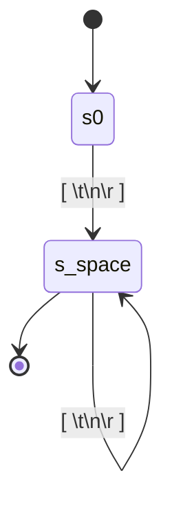
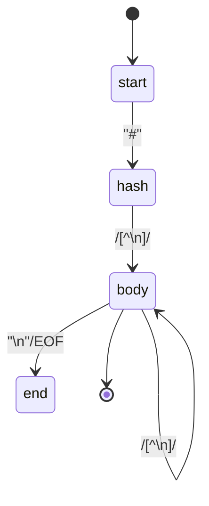
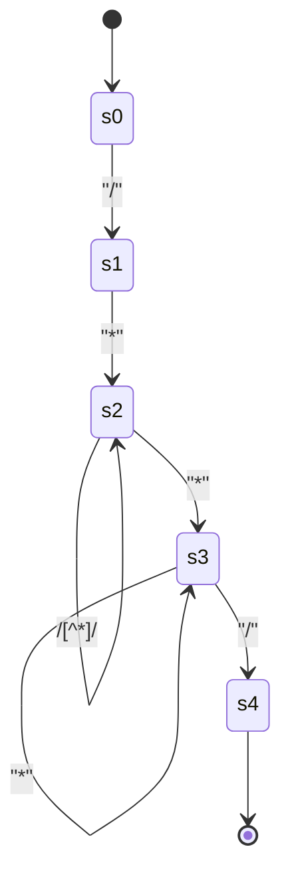
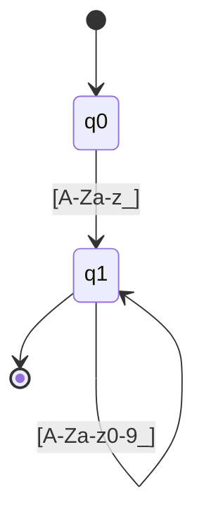
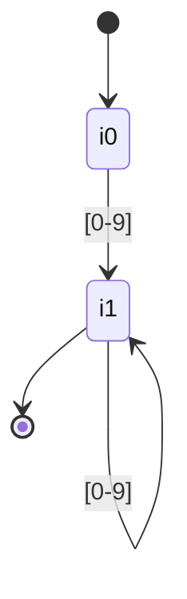
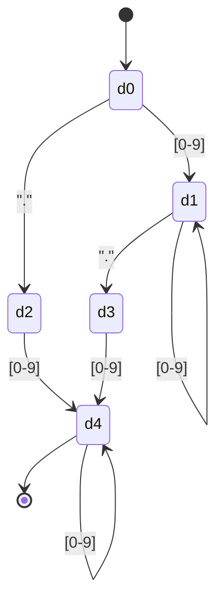
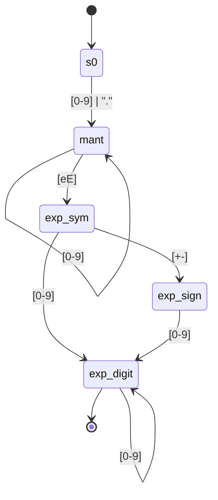
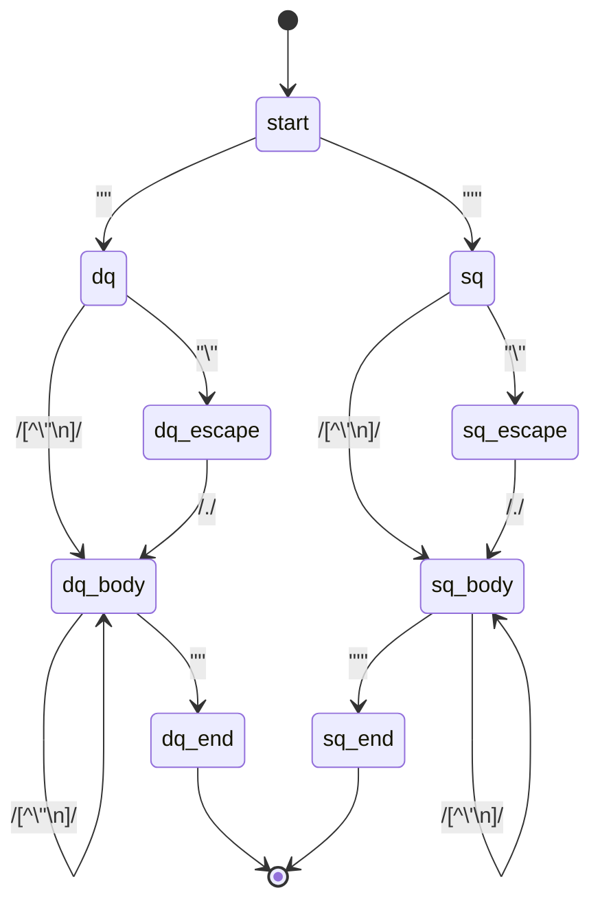
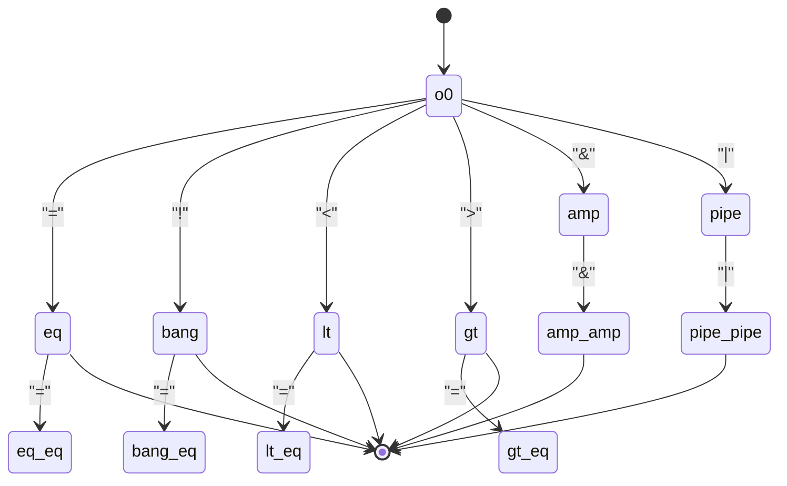
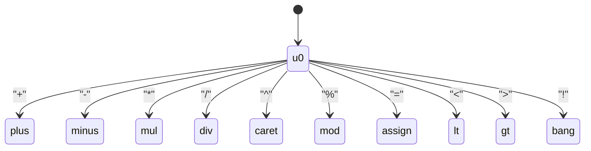

# AFDs — Diagramas (Markdown + Mermaid) para NanoCalc

**Data:** 28/09/2025
**Autor:** Equipe-Kamikaze (Rafael & João)

---

Este documento contém diagramas em **Mermaid** para AFDs (autômatos finitos determinísticos) correspondentes aos tokens principais da especificação léxica do **NanoCalc**. Inclui também um esboço de implementação em Python (AFD simples + testes unitários) para você rodar localmente.

> Observação: para o analisador léxico final, convém gerar DFAs a partir de expressões regulares via construção NFA→DFA (Thompson + subset construction) e depois minimizar (Hopcroft). Aqui damos AFDs manuais/desenhados para os tokens mais importantes.

---

## Índice
1. WHITESPACE
2. COMMENT_LINE (`# ...`)
3. COMMENT_BLOCK (`/* ... */`)
4. ID / KEYWORD
5. NUMBER: INT, DEC, SCI
6. STRING (aspas duplas / simples)
7. OPERATORS (2-char + 1-char)
8. DELIMITERS
9. Exemplo de implementação em Python (AFD matcher)
10. Testes unitários de exemplo

---

## 1) WHITESPACE

(aceita ao menos um caractere de espaço; transição para estado final `s_space`)

---

## 2) COMMENT_LINE  (`#` até fim da linha)

Observação: o autômato aceita `#` seguido de qualquer sequência (incluindo vazia) até `\n` ou EOF.

---

## 3) COMMENT_BLOCK (`/* ... */`)

Este autômato exige `/*` para entrar no bloco e só aceita quando encontra `*/`. (Erros: EOF antes de `*/`).

---

## 4) ID / KEYWORD

Post-processamento (lexer): verificar se o lexema é uma palavra‑chave e classificar como `KEYWORD` caso positivo.

---

## 5) NUMBER (INT, DEC, SCI)
Para clareza apresentamos 3 diagramas relacionados.

### 5.1 INT


### 5.2 DEC (com ou sem parte inteira)

Explica: aceita `123.456`, `123.`, `.5`.

### 5.3 SCI (exponencial)

Combina com INT/DEC seguidos de `e` ou `E` e um expoente inteiro com sinal opcional.

---

## 6) STRING ("..." e '\'...\')

Aceita escapes simples; erro se EOF antes do fechamento.

---

## 7) OPERATORS (2-char então 1-char — maximal munch)
### 7.1 Operadores compostos (==, !=, <=, >=, &&, ||)

### 7.2 Operadores unitários

(Quando a leitura reconhecer `=` seguido de `=` -> `==`, por exemplo.)

---

## 8) DELIMITERS
```mermaid
stateDiagram-v2
    [*] --> d0
    d0 --> p_op["("]
    d0 --> p_cl[")"]
    d0 --> b_op["{"]
    d0 --> b_cl["}"]
    d0 --> sb_op["["]
    d0 --> sb_cl["]"]
    d0 --> comma[","]
    d0 --> colon[":"]


```

---

## 9) Implementação em Python — AFD matcher (esboço)
Abaixo um esboço simples (sem minimização) que implementa matchers para alguns tokens com DFAs manuais. Para produção, gere DFAs automaticamente com NFA→DFA + minimização.

```python
# afd_matchers.py
from typing import Tuple, Optional

class DFAMatcher:
    def __init__(self, transitions, start, finals):
        self.transitions = transitions
        self.start = start
        self.finals = finals

    def match(self, s: str) -> Optional[int]:
        """Tenta casar o maior prefixo de s. Retorna comprimento do maior prefixo aceito ou None."""
        state = self.start
        last_accept = None
        for i, ch in enumerate(s):
            key = (state, ch)
            # transições por classe
            # procura transição literal, depois classes simples
            trans = None
            if (state, ch) in self.transitions:
                trans = self.transitions[(state, ch)]
            else:
                # classes: digit, letter, underscore, whitespace
                if ch.isdigit() and (state, 'DIGIT') in self.transitions:
                    trans = self.transitions[(state, 'DIGIT')]
                elif (ch.isalpha() or ch == '_') and (state, 'ALPHA') in self.transitions:
                    trans = self.transitions[(state, 'ALPHA')]
                elif ch.isspace() and (state, 'SPACE') in self.transitions:
                    trans = self.transitions[(state, 'SPACE')]
                elif (state, 'ANY') in self.transitions:
                    trans = self.transitions[(state, 'ANY')]
            if trans is None:
                break
            state = trans
            if state in self.finals:
                last_accept = i+1
        return last_accept

# Exemplo: matcher para ID
id_trans = {
    (0, 'ALPHA'): 1,
    (1, 'ALPHA'): 1,
    (1, 'DIGIT'): 1,
    (1, '_'): 1,
}
id_dfa = DFAMatcher(id_trans, 0, {1})

if __name__ == '__main__':
    tests = ['abc123', '9abc', '_ok', 'ok_var']
    for t in tests:
        m = id_dfa.match(t)
        print(t, '->', m)
```

---

## 10) Testes unitários de exemplo (pytest)
```python
# test_afds.py
from afd_matchers import id_dfa

def test_id():
    assert id_dfa.match('abc') == 3
    assert id_dfa.match('abc123def') == 9
    assert id_dfa.match('9abc') is None
    assert id_dfa.match('_a') == 2
```

---

*Fim — AFDs.*

