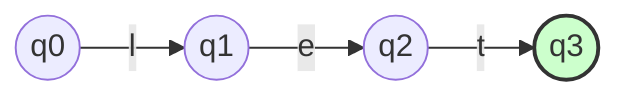

# Analisador Léxico — Implementação Final (NanoCalc)

## 1. Conversão AFN → AFD (algoritmo de construção de subconjuntos)

```python
# src/lexer/afn_to_afd.py
# (conteúdo conforme entregue na resposta anterior)
# Coloque aqui o código completo do algoritmo de subconjuntos.
```

## 2. Implementação do Analisador Léxico (usando o AFD)

```python
# src/lexer/lexer.py
# (conteúdo conforme entregue na resposta anterior)
# Inclua aqui o código completo do Lexer.
```

## 3. Diagrama Mermaid do AFD Final



